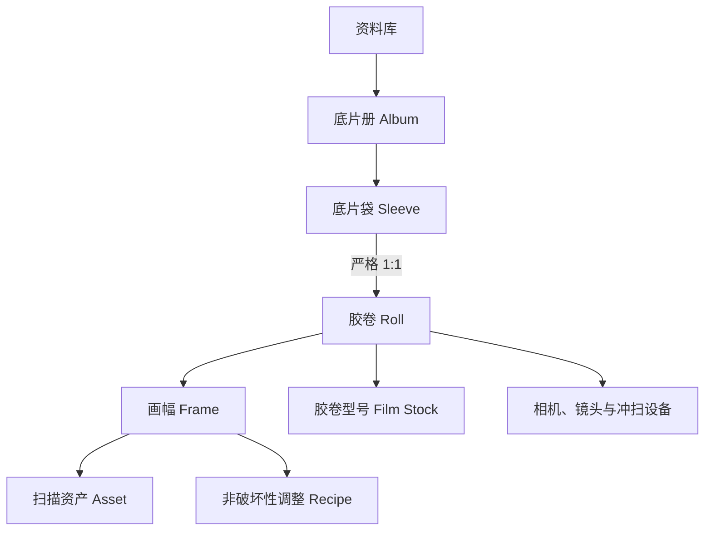
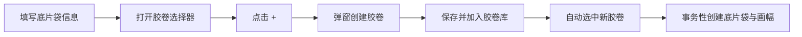
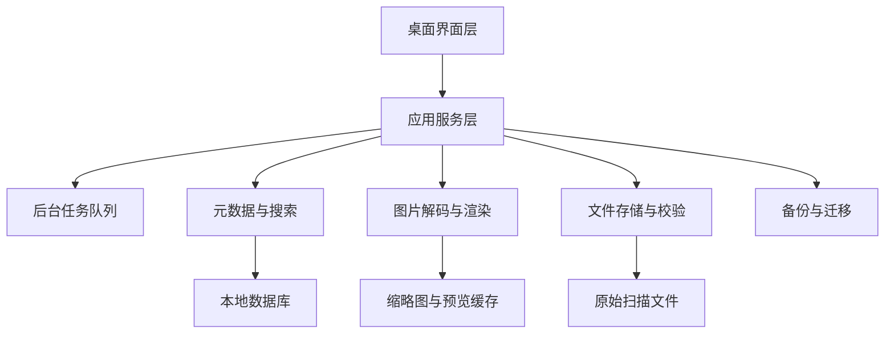

# FilmManage 桌面端产品需求与设计文档

> 文档版本：V1.2（保留胶卷使用计数）  
> 更新日期：2026-08-17  
> 产品形态：桌面端本地应用  
> 需求来源：《胶片管理应用：产品与系统设计文档》V1.4 及已确认的需求调整

## 1. 文档目的

本文重新定义 FilmManage 桌面端应用的产品需求、业务规则、界面结构、数据模型、技术边界和 MVP 验收标准，用于产品汇报、原型设计、技术选型、开发拆分和测试验收。

本文件是独立的桌面端需求文档，不依赖移动端交互方式。设计优先考虑：

- 大屏幕、多栏信息展示；
- 鼠标、键盘、右键菜单和拖拽操作；
- TIFF 等大尺寸扫描文件；
- 文件夹导入、批量整理和后台任务；
- 本地资料库、完整备份和长期迁移；
- 多显示器、全屏和 HDR 观片场景。

## 2. 产品概述

### 2.1 产品定位

FilmManage 是一款面向胶片摄影用户的桌面端本地档案管理应用，主要管理已经完成冲洗和扫描的底片，并提供实体收纳映射、数字归档、观片、整理和简单处理能力。

产品以“底片册—底片袋—胶卷—画幅—图片文件”为核心档案结构。底片库就是扫描后底片的数字资料库，不再额外设计“扫描件管理”模块。胶卷、相机、镜头、胶片型号和扫描设备等功能，主要用于为底片袋及其中画幅补充信息。

一句话定位：

> 面向已冲扫胶片的实体归档、数字观片和简单处理工具。

### 2.2 目标用户

- 长期保存和整理已冲扫底片的摄影爱好者；
- 使用多台相机、镜头和多种胶卷的用户；
- 使用扫描仪或数码相机翻拍底片，需要管理 TIFF、JPEG 等文件的用户；
- 希望按实体底片册和底片袋整理数字底片的用户；
- 需要补充 EXIF、制作联系表并长期备份扫描文件的用户。

### 2.3 桌面端平台范围

建议首期支持 macOS 和 Windows，Linux 作为后续评估平台。具体开发框架在技术选型阶段确定，本文不提前限定原生、Flutter、Electron、Tauri 或其他方案。

桌面端必须满足：

- 离线可用；
- 本地资料库可自由选择位置；
- 支持鼠标和键盘完整操作；
- 支持高分辨率及缩放显示；
- 长任务后台执行，不阻塞主窗口；
- 应用退出或系统重启后可以恢复未完成任务。

### 2.4 设计原则

1. **原片安全**：默认不修改、不覆盖原始扫描文件。
2. **本地优先**：核心能力不依赖网络和账号。
3. **一袋一卷**：底片袋与胶卷严格一对一。
4. **胶卷独立存在**：胶卷可以先在胶卷库建立，之后再关联底片袋。
5. **胶卷计数必须保留**：每卷胶卷都显示使用计数，该数值由唯一底片袋中的有效画幅自动计算。
6. **桌面效率优先**：充分利用拖拽、多选、右键菜单、快捷键和批量操作。
7. **拟物与效率并存**：底片册和观片台保留拟物表现，同时提供表格与网格视图。
8. **数据可迁移**：支持图片、元数据和完整资料库导出，不锁定用户数据。

### 2.5 功能主次关系

核心功能：

- 底片册和底片袋管理；
- 底片图片导入；
- 单张、整卷和底片袋观片；
- 搜索、整理和批量编辑；
- 旋转、裁剪、反相和去色罩等简单处理；
- 导出、备份和恢复。

辅助功能：

- 胶卷库：为底片袋提供胶卷编号、型号、日期及冲扫信息；
- 相机和镜头：为底片袋或画幅提供器材信息；
- 胶卷型号：为底片袋提供胶片品牌、类型、ISO 和规格；
- 扫描设备：为底片袋提供数字化来源信息。

桌面端明确不承担拍摄中、待冲洗、冲洗中和待扫描等状态管理。这类需要随拍随记的能力更适合手机端，不进入本桌面产品范围。

## 3. 核心概念

| 概念 | 定义 |
| --- | --- |
| 底片册（Album） | 实体归档的上层容器，可以包含多个底片袋 |
| 底片袋（Sleeve） | 底片册中的实体收纳单元，必须且只能关联一卷胶卷 |
| 胶卷（Roll） | 与一袋已冲扫底片对应的胶卷信息记录，可以在未关联底片袋时独立存在 |
| 胶卷型号（Film Stock） | 厂牌、系列、类型、ISO 和规格等可复用预设资料 |
| 画幅／底片（Frame） | 胶卷中的单张实体底片，可以先作为占位记录存在 |
| 图片资产（Asset） | 底片库中与画幅关联的原始图片、预览和导出版本 |
| 调整配方（Recipe） | 非破坏性的旋转、裁剪、反相和去色罩等参数 |
| 胶卷计数／胶卷使用计数（`usage_count`） | 唯一对应底片袋中的有效底片数量，由系统自动计算，属于必须保留的核心字段 |

### 3.1 核心关系



业务约束：

- 一个底片册可以包含多个底片袋；
- 一个底片袋必须关联一卷胶卷；
- 一卷胶卷最多关联一个底片袋；
- 未关联底片袋的胶卷显示为“未装袋”；
- 一张画幅属于一卷胶卷；
- 一张画幅可以关联多个数字资产，但必须区分原始扫描和衍生文件。

## 4. 桌面端信息架构

### 4.1 主窗口布局

```text
┌──────────────────────────────────────────────────────────────┐
│ 工具栏：返回 / 新建 / 导入 / 搜索 / 视图 / 导出 / 任务状态  │
├──────────────┬───────────────────────────────┬───────────────┤
│ 左侧边栏     │ 主内容区                      │ 右侧检查器    │
│              │                               │               │
│ 首页         │ 卡片 / 网格 / 表格 / 观片台  │ 元数据        │
│ 底片库       │                               │ 器材与日期    │
│ 胶卷库       │                               │ 标签与备注    │
│ 器材库       │                               │ 文件与调整    │
│ 观片台       │                               │               │
│ 最近删除     │                               │               │
├──────────────┴───────────────────────────────┴───────────────┤
│ 底部状态栏：选择数量 / 筛选条件 / 后台任务 / 资料库状态      │
└──────────────────────────────────────────────────────────────┘
```

### 4.2 一级入口

1. **首页**：展示最近归档的底片袋。
2. **底片库**：底片册、底片袋和实体归档位置。
3. **胶卷库**：独立创建和管理全部胶卷。
4. **器材库**：相机、镜头、胶卷型号和扫描设备，为底片档案提供可复用信息。
5. **观片台**：单张、整卷和底片袋沉浸浏览。
6. **最近删除**：恢复或永久删除内容。
7. **设置**：资料库、导入导出、显示、备份、隐私和快捷键。

### 4.3 桌面交互规范

- 支持列表、网格和拟物视图切换；
- 支持 `Shift` 连选、`Ctrl/Cmd` 多选和框选；
- 支持拖拽文件、文件夹、胶卷和底片袋；
- 常用操作同时提供工具栏、右键菜单和快捷键入口；
- 双击进入详情或观片，空格键快速预览；
- 右侧检查器支持单项编辑和多选批量编辑；
- 检查器可以折叠，左侧边栏可以调整宽度；
- 长任务进入任务中心，显示进度、失败项、暂停、取消和重试；
- 删除、覆盖、重新绑定和恢复资料库等高风险操作必须明确提示影响范围。

## 5. 功能需求

### 5.1 首页：最近归档

桌面端不承担拍摄中、待冲洗或待扫描等移动场景的状态管理。首页聚焦已经完成冲扫并进入资料库的内容。

首页主体按最近归档时间展示底片袋。可以在顶部附带当前资料库的底片册数、底片袋数、胶卷数和有效画幅数，但不再展示拍摄或冲扫状态栏目。

底片袋卡片显示：

- 底片袋编号和所属底片册；
- 胶卷型号、相机和拍摄日期等摘要信息；
- 底片数量；
- 代表性底片缩略图；
- 最近导入或修改时间。

快捷操作只保留：

- 创建底片袋；
- 打开底片册；
- 导入底片图片；
- 进入观片台；
- 全局搜索。

### 5.2 底片库

#### 5.2.1 底片册

- 创建、重命名、移动、归档和删除底片册；
- 设置封面、描述、排序和时间范围；
- 支持拟物封面、网格和表格视图；
- 通过拖拽调整底片袋顺序或移动到底片册；
- 删除底片册时可以移动底片袋、让胶卷退回未装袋，或整组移入最近删除。

#### 5.2.2 创建底片袋

创建窗口采用桌面端模态窗口或侧边表单，包含两个区域。

底片袋信息：

- 所属底片册；
- 底片袋编号；
- 胶片规格；
- 版式和分条方式；
- 实际底片数量；
- 备注。

胶卷信息：

- 必须选择一卷尚未装袋的胶卷；
- 下拉选择器支持搜索胶卷编号、型号、相机和日期；
- 已关联其他底片袋的胶卷不出现在普通列表中；
- 点击选择器旁的“+”弹出创建胶卷窗口；
- 新胶卷保存后进入胶卷库，并自动回填到当前底片袋；
- 取消胶卷窗口时，不清空已填写的底片袋信息；
- 未选择胶卷不能保存底片袋。

保存规则：

- 底片袋和胶卷必须严格一对一；
- 底片袋规格必须与胶卷规格一致；
- 实际底片数量用于生成对应数量的画幅占位记录；
- 创建底片袋、绑定胶卷和生成画幅必须在同一事务内完成；
- 任一步失败都不得留下空底片袋、重复关联或部分画幅。

#### 5.2.3 底片袋详情

- 同时展示底片袋信息、胶卷摘要和画幅列表；
- 支持跳转到胶卷库中的完整胶卷详情；
- 支持修改袋号、版式、排序和备注；
- 支持增加或减少有效画幅，胶卷使用计数同步变化；
- 支持拖拽底片图片到指定画幅；
- 删除底片袋时，可以让胶卷退回未装袋，或将两者一起删除。

### 5.3 胶卷库

胶卷库独立存在，不依赖底片袋。

#### 5.3.1 胶卷管理

- 新建、编辑、复制、搜索、筛选和删除胶卷信息；
- 按是否关联底片袋、胶卷型号、规格、相机和日期筛选；
- 支持表格、卡片和缩略图视图；
- 胶卷列表和胶卷详情必须显示胶卷使用计数；
- 支持保存筛选条件；
- 支持批量修改标签、相机、胶片型号和冲扫信息；
- 未装袋胶卷可以点击“添加到底片袋”；
- 已装袋胶卷可以跳转到唯一关联底片袋。

#### 5.3.2 胶卷字段

必填字段：

- 胶卷编号：自动生成，可修改，资料库内唯一；
- 胶卷型号；
- 胶片规格；
- 标称 ISO。

可选字段：

- 实际曝光 ISO；
- 默认相机和镜头；
- 拍摄地点、日期和备注；
- 冲洗店、冲洗工艺和日期；
- 扫描仪、扫描软件、分辨率和色彩空间；
- 标签；
- 胶卷使用计数：由关联底片袋中的有效画幅自动计算。

#### 5.3.3 胶卷计数（必须保留）

胶卷计数即胶卷使用计数 `usage_count`，表示唯一对应底片袋中的有效底片数量。该功能必须保留，规则如下：

- `usage_count` 等于该胶卷下 `deleted_at` 为空的画幅数量；
- 未关联底片袋的胶卷使用计数为 0，界面显示“未关联底片袋”；
- 新增、删除或恢复画幅时自动更新；
- 回收站中的画幅不计入当前数量；
- 该数值为派生值，用户不能在胶卷详情中单独修改；
- 底片袋和胶卷严格一对一，因此计数不跨袋汇总，也不会重复计算。

### 5.4 底片导入

底片导入是底片库内部能力，不作为独立的“扫描件管理”模块。所有导入图片都必须归入一个底片袋及其唯一胶卷。

#### 5.4.1 导入入口

- 工具栏“导入”；
- 文件菜单；
- 将文件或文件夹拖入窗口；
- 将文件拖到具体底片袋或画幅；
- 从系统文件选择器选择文件夹。

#### 5.4.2 支持格式

MVP 至少支持：

- JPEG；
- PNG；
- TIFF。

HEIF/HEIC、DNG、PSD 等格式根据平台解码能力和用户需求后续确认。

#### 5.4.3 导入流程

1. 创建或选择目标底片袋，并确认其唯一关联胶卷；
2. 检查图片格式、大小和重复项；
3. 按文件名、文件时间、EXIF 或拖拽确定顺序；
4. 将文件匹配到已有画幅占位记录；
5. 预览画幅编号和冲突；
6. 选择文件存储策略；
7. 后台复制、计算哈希和生成缩略图；
8. 输出成功与失败清单。

文件存储策略：

- **复制到资料库（默认）**：应用管理独立副本；
- **引用原文件**：保留原位置，路径失效时支持重新定位。

默认保留原文件字节，不进行二次编码。无损缓存或有损预览必须与原始文件明确区分。

#### 5.4.4 桌面文件能力

- 支持批量拖拽数百个文件；
- 支持后台导入和取消；
- 支持重复文件哈希检测；
- 支持重新定位移动后的引用文件；
- 支持在系统文件管理器中显示原文件；
- 支持重新生成缩略图；
- 后续可增加监视文件夹，但不纳入 MVP。

### 5.5 画幅与元数据

画幅字段包括：

- 画幅编号；
- 收藏、评分、色标和标签；
- 拍摄日期和时间；
- 地点名称和经纬度；
- 相机和镜头；
- 光圈、快门、曝光补偿、实际 ISO 和焦距；
- 标题、说明和备注；
- 原始文件、调整版本和导出记录。

桌面编辑方式：

- 在右侧检查器编辑当前画幅；
- 多选画幅后批量填写器材、日期、地点和标签；
- 多选编辑不得静默覆盖已经单独设置的值；
- 胶卷默认值可以继承到画幅；
- 界面显示元数据来源：画幅手动值、胶卷默认值、文件 EXIF 或预设。

### 5.6 器材与胶片信息库

器材、胶片型号和扫描设备不是独立业务核心，而是为底片袋、胶卷和画幅提供可复用的元数据信息。

#### 5.6.1 相机

支持两种创建方式：

- **从预置款式添加**：搜索内置品牌和型号，将预设复制到“我的相机”；
- **完全自定义**：自行填写品牌、型号和参数。

要求：

- 自定义相机与预置相机拥有完全相同的关联能力；
- 支持小众、老式、改装和预设库不存在的相机；
- 预置库更新不得覆盖用户修改；
- 字段包括品牌、型号、显示名称、序列号、画幅规格、购入日期、状态、备注和照片。

#### 5.6.2 镜头

支持自定义品牌、型号、卡口、焦距或变焦范围、最大光圈、序列号、状态和备注。

#### 5.6.3 胶卷型号

- 内置常用厂牌和型号；
- 支持用户创建自定义型号；
- 支持 135、120、4×5、8×10 和自定义规格；
- 字段包括品牌、系列、类型、ISO、规格、默认画幅容量和备注；
- 系统预设不可直接破坏性修改，可以复制后自定义；
- 预设带来源和版本，升级不覆盖用户数据。

#### 5.6.4 扫描设备

管理扫描仪品牌、型号、扫描软件、默认分辨率、色彩空间和备注。

### 5.7 观片台

观片台支持：

1. **单张模式**：放大检查、元数据查看和调整前后对比；
2. **整卷模式**：横向连续展示整卷画幅；
3. **底片袋模式**：按照胶片规格和分条方式模拟实体底片袋。

桌面能力：

- 鼠标滚轮或触控板缩放；
- 拖动平移；
- 键盘切换上一张和下一张；
- 全屏和无干扰模式；
- 多显示器选择；
- 在副显示器观片，主显示器保留资料管理界面；
- 背景亮度、色温和网格设置；
- 显示或隐藏画幅编号和元数据；
- 相邻画幅预加载；
- 超大图分级预览和按需解码。

#### HDR 显示规则

- 检测操作系统、显示器、图片格式和渲染链路是否支持 HDR；
- 真正包含 HDR 或增益图信息的图片可以启用 HDR；
- 普通 SDR 图片不得被描述为真实 HDR；
- 可选的 SDR 显示增强必须可以关闭，且不修改原图；
- 不支持 HDR 时自动使用色彩正确的 SDR；
- HDR 为后续增强能力，不阻塞 MVP。

### 5.8 基础处理

所有编辑均采用非破坏性参数，不覆盖原始扫描文件。

基础能力：

- 旋转、翻转和裁剪；
- 水平校正；
- 负片反相和基础去色罩；
- 重置、撤销、重做和调整前后对比；
- 将调整复制到同卷其他画幅；
- 批量应用后允许单张继续调整。

后续能力：

- 曝光、对比度、高光和阴影；
- 白平衡和黑白转换；
- RGB 及分通道曲线；
- 更高级的去色罩、去尘、降噪和锐化。

### 5.9 搜索与批量整理

- 全局搜索胶卷编号、标题、备注、地点和器材；
- 按底片册、底片袋、胶卷型号、规格、相机、镜头、日期、评分和标签筛选；
- 支持组合筛选和保存筛选条件；
- 支持表格列排序；
- 支持批量移动底片袋；
- 支持批量修改胶卷或画幅元数据；
- 搜索结果可以直接进入观片台或批量导出。

### 5.10 导出

支持导出：

- 单张图片；
- 多选画幅；
- 整卷；
- 底片袋联系表；
- 底片册；
- JSON／CSV 元数据；
- 完整可迁移包。

图片设置：格式、尺寸、质量、色彩空间、命名模板、水印和输出目录。

EXIF／XMP 规则：

- 永不默认覆盖原始扫描文件；
- 写入新生成的导出副本；
- 相机、镜头、日期和曝光参数写入标准字段；
- 胶卷型号、冲洗和扫描信息写入 XMP 或应用命名空间；
- 格式无法承载的信息输出到 XMP sidecar 或 JSON；
- 分享导出默认建议移除 GPS 和序列号。

### 5.11 备份、恢复与迁移

完整备份包括：

- 数据库和全部元数据；
- 应用管理的原始底片图片；
- 调整参数；
- 自定义相机、胶卷型号和器材资料；
- 应用设置和文件关联信息；
- 可选包含引用模式下的外部原文件。

要求：

- 支持一键完整备份和恢复；
- 备份前估算空间；
- 备份后生成清单并校验；
- 恢复前展示版本、时间和内容；
- 恢复失败不得破坏当前资料库；
- 资料库和备份格式带版本号；
- 支持可选加密；
- 密码丢失时明确无法恢复；
- 增量备份和云同步后续评估。

## 6. 关键流程

### 6.1 核心流程


所有其他功能均围绕这一流程服务：胶卷型号、相机、镜头和扫描设备用于补充底片袋及画幅信息；胶卷库用于复用胶卷信息；文件、搜索、处理和导出能力用于管理底片内容。

### 6.2 从底片袋现场新建胶卷



### 6.3 底片图片导入


## 7. 数据设计

### 7.1 主要实体

| 实体 | 关键字段 | 关系 |
| --- | --- | --- |
| Album | id、name、cover、description、sort_order | 包含多个 Sleeve |
| Sleeve | id、album_id、roll_id、sleeve_code、layout、format、notes | `roll_id` 非空且唯一 |
| Roll | id、roll_code、film_stock_id、camera_id、format、拍摄日期、冲洗与扫描信息、usage_count（派生值） | 可独立存在，最多被一个 Sleeve 引用；列表和详情显示使用计数 |
| Frame | id、roll_id、frame_no、元数据、评分、位置、deleted_at | 属于一个 Roll，可作为无文件占位记录 |
| Asset | id、frame_id、uri、storage_mode、mime_type、size、hash、尺寸、色彩配置 | 属于一个 Frame |
| Recipe | id、frame_id、version、parameters | 属于一个 Frame |
| CameraPreset | id、品牌、型号、规格、来源、版本 | 用于创建 Camera |
| Camera | id、preset_id、source、品牌、型号、规格、序列号、用户字段 | 预置或完全自定义 |
| Lens | id、品牌、型号、卡口、焦距、光圈、序列号 | 被 Roll／Frame 引用 |
| FilmStock | id、source、品牌、系列、类型、ISO、规格、版本 | 被 Roll 引用，为底片档案补充胶片信息 |
| Scanner | id、品牌、型号、软件、默认参数 | 被 Roll 引用 |
| Tag | id、name、color | 与 Roll／Frame 多对多 |
| ExportRecord | id、scope、settings、output_uri、status、time | 记录导出任务 |

### 7.2 一对一约束

数据库必须对 `Sleeve.roll_id` 同时设置：

- `NOT NULL`：禁止创建没有胶卷的底片袋；
- `UNIQUE`：禁止同一胶卷被多个底片袋引用；
- 外键约束：胶卷不存在时禁止创建关联；
- 事务：底片袋、胶卷关联和画幅占位必须同时成功或同时失败。

### 7.3 使用计数

```text
usage_count = COUNT(Frame)
WHERE Frame.roll_id = 当前胶卷
  AND Frame.deleted_at IS NULL
  AND 当前胶卷被唯一 Sleeve.roll_id 引用
```

`usage_count` 不允许成为独立手工字段。如果为列表性能增加缓存，缓存只能由画幅新增、删除、恢复事件更新，`Frame` 表始终是最终数据源。

### 7.4 文件一致性

- 保存文件大小、修改时间和内容哈希；
- 数据库写入和文件复制使用可恢复任务；
- 缩略图和预览可以重建；
- 引用文件失效时保留元数据和预览；
- 提供资料库完整性检查；
- 不允许应用异常退出后留下无法识别的半成品导入。

## 8. 逻辑系统设计



模块职责：

- **桌面界面层**：窗口、导航、多栏布局、拖拽、快捷键和批量交互；
- **应用服务层**：底片袋、胶卷、画幅及业务事务；
- **任务队列**：导入、哈希、缩略图、导出、备份和恢复；
- **元数据模块**：数据库、筛选、全文搜索和数据迁移；
- **媒体模块**：格式检测、色彩管理、预览和非破坏性渲染；
- **存储模块**：复制、引用、路径重定位、回收站和完整性校验；
- **备份模块**：清单、校验、加密、恢复和版本兼容。

## 9. 非功能需求

### 9.1 性能

- 10,000 张画幅下，常用列表与筛选在 1 秒内返回可见结果；
- 已有预览的图片在本地磁盘环境下 300 毫秒内显示首屏；
- 列表和网格采用虚拟化；
- 整卷观片不一次解码全部原图；
- 导入、导出和备份不阻塞界面；
- 内存压力较高时主动释放非当前大图；
- 支持高 DPI 显示，不使用模糊缩放素材。

### 9.2 可靠性

- 长任务支持暂停、取消和重试；
- 异常退出后可以恢复未完成任务；
- 数据库升级前创建可恢复快照；
- 导入和恢复操作具有事务或检查点；
- 文件错误、空间不足和权限问题必须明确提示；
- 计数和一对一关系必须有数据库级约束，不能只依赖界面。

### 9.3 隐私与安全

- 默认不上传图片、位置、序列号和统计数据；
- 日志不记录密码、精确位置和不必要的完整路径；
- 分享导出支持移除 GPS 与序列号；
- 备份加密使用成熟标准；
- 如果未来加入云同步或遥测，必须单独取得同意。

### 9.4 可访问性

- 核心功能可通过键盘完成；
- 所有控件具有可读标签和焦点状态；
- 不仅依赖颜色表达状态；
- 支持系统字体缩放和高对比度；
- 图片背景使用中性色，减少色彩判断干扰。

## 10. MVP 范围

### 10.1 Must Have

- macOS／Windows 桌面主窗口和多栏布局；
- 首页最近归档；
- 独立胶卷库；
- 底片册和底片袋管理；
- 底片袋与胶卷数据库级严格一对一；
- 底片袋选择已有胶卷及“+”新建胶卷；
- 由有效画幅自动计算的胶卷使用计数；
- 相机预置和完全自定义；
- JPEG、PNG、TIFF 文件与文件夹导入；
- 复制到资料库和引用原文件；
- 表格、网格、右侧检查器和基础批量编辑；
- 单张、整卷和底片袋浏览；
- 搜索、筛选和排序；
- 图片及 EXIF／XMP 导出；
- 回收站、完整备份和恢复。

### 10.2 Should Have

- 旋转、裁剪、反相和基础去色罩；
- 整卷批量应用调整；
- 联系表导出；
- 引用文件批量重新定位；
- 多显示器观片；
- 自定义快捷键。

### 10.3 Could Have

- HDR 显示；
- 监视文件夹；
- 地图视图；
- 曝光、白平衡和曲线；
- 增量备份；
- 云同步和跨设备共享；
- 高级去色罩、去尘、降噪和锐化；
- 外部编辑器往返处理。

## 11. MVP 验收标准

1. 用户可以在胶卷库独立创建胶卷，不需要先建立底片袋。
2. 用户可以在创建底片袋时选择已有未装袋胶卷。
3. 没有对应胶卷时，用户点击“+”创建胶卷，保存后新胶卷自动选中，已填写的底片袋内容不丢失。
4. 数据库禁止空底片袋、一个底片袋关联多卷胶卷或一卷胶卷关联多个底片袋。
5. 用户填写实际底片数量后，系统生成对应数量的画幅占位记录。
6. 胶卷使用计数始终等于唯一底片袋中的有效画幅数量；新增、删除和恢复画幅后立即正确更新。
7. 用户可以从预置款式添加相机，也可以建立完全自定义相机，并将其作为底片袋或画幅信息使用。
8. 用户可以拖入一整个文件夹，将底片图片按顺序匹配到画幅。
9. 导入、哈希和缩略图生成在后台执行，主窗口仍可操作。
10. 用户可以多选画幅并在右侧检查器批量修改元数据。
11. 单张、整卷和底片袋模式均能浏览，超大图片不会阻塞整个窗口。
12. 任意简单处理不会改变原始文件哈希。
13. 导出副本可以写入受支持的 EXIF／XMP，并允许移除位置和序列号。
14. 完整备份可以在空资料库恢复底片册、底片袋、胶卷、画幅、器材、调整和托管文件。
15. 引用文件移动后可以批量重新定位。
16. 导入、备份或应用异常退出不会破坏已有资料库。

## 12. 待确认事项

1. 首发平台是同时支持 macOS 和 Windows，还是先发布其中一个？
2. 是否需要兼容 Linux？
3. 典型资料库规模和单个扫描文件大小是多少？
4. 除 JPEG、PNG、TIFF 外，是否必须支持 DNG、HEIF、PSD？
5. 用户主要导入扫描仪生成的正片，还是相机翻拍的负片原图？
6. 首版是否必须提供 HDR，还是可以在稳定归档流程后增加？
7. 资料库默认采用托管模式还是首次启动时让用户选择？
8. 是否需要便携资料库，以便放在移动硬盘中跨电脑使用？
9. 内置相机和胶卷型号数据的来源、版权和更新责任如何确定？
10. 首版简单处理只提供旋转、裁剪、反相与去色罩，还是同时提供曝光和曲线？
11. 是否需要插件机制或外部编辑器往返处理能力？

## 13. 迭代建议

### 阶段一：桌面资料库闭环

完成主窗口、最近归档首页、胶卷库、底片册、底片袋、一对一约束、辅助信息库、底片导入、检索、基础观片、导出、备份和恢复。

### 阶段二：桌面效率与胶片体验

完善拖拽、右键菜单、快捷键、批量编辑、任务中心、拟物底片袋、整卷观片和联系表。

### 阶段三：简单处理

完成统一色彩管线、反相、去色罩、旋转、裁剪和整卷批量应用；曝光、白平衡和曲线根据实际需求再决定是否扩展。

### 阶段四：高级桌面能力

评估 HDR、多显示器增强、监视文件夹、外部编辑器、增量备份、云同步和跨平台资料库。
