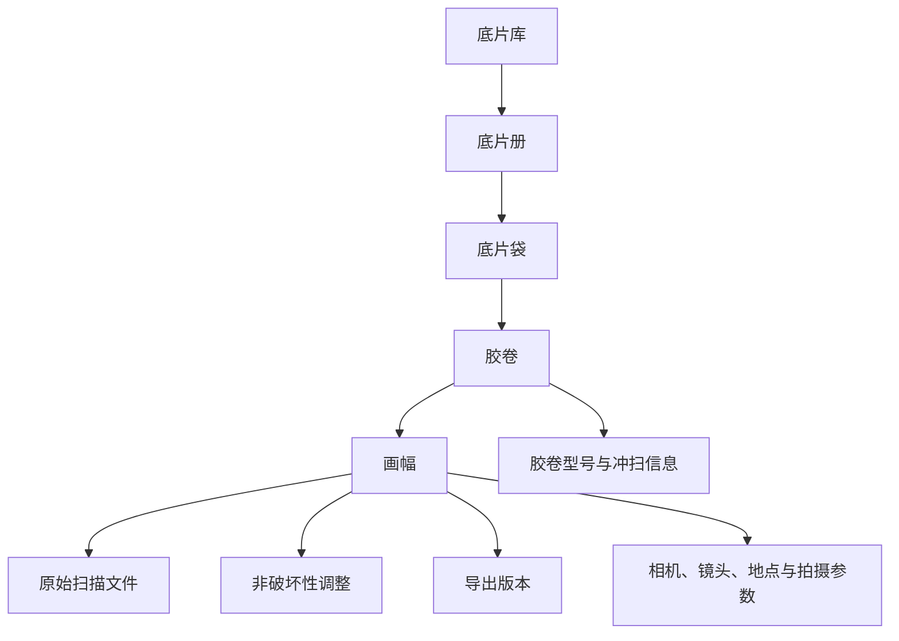
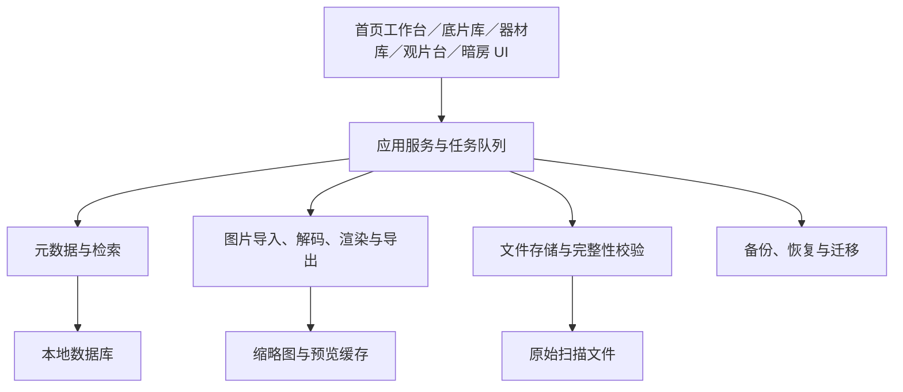

# 胶片管理应用：产品与系统设计文档

> 文档状态：V1.3（底片袋与胶卷联合管理稿）  
> 更新日期：2026-08-17  
> 依据：仓库中的《设计文档.md》与《Canister竞品对比分析.md》  
> 说明：本文区分“已确认需求”“建议方案”和“待确认事项”。在待确认事项达成结论前，技术实现应保留替换空间。

## 1. 文档目的

本文用于统一胶片管理应用的产品范围、核心概念、用户流程、功能优先级、数据模型和技术边界，并作为原型设计、开发拆分、测试验收的基础。

原始构想包含四个主要入口：底片库、器材库、观片台和设置。本文保留这一信息架构，同时补充以下原文未明确的部分：

- 胶片、扫描文件、相册和器材之间的关系；
- 原始文件保护与非破坏性编辑原则；
- EXIF 导出、HDR 显示和无损压缩的能力边界；
- 搜索、备份、恢复、数据迁移和异常处理；
- MVP 范围、迭代计划和可验收标准。

## 2. 产品概述

### 2.1 产品定位

一款面向胶片摄影用户的本地优先数字资产管理工具，用于整理胶卷扫描件、记录拍摄与冲扫信息、管理摄影器材，并以接近真实底片册和观片台的方式浏览胶片。

产品的核心价值不是普通图片浏览，而是把“底片册—底片袋—胶卷—画幅—器材—拍摄信息—扫描文件—调整记录”组织成可长期保存、可查找、可迁移的个人胶片档案。

### 2.2 目标用户

- 有持续拍摄、冲洗和扫描习惯的胶片摄影爱好者；
- 同时使用多台相机、镜头和多种胶卷的用户；
- 希望按旅程、项目、器材或胶卷建立档案的收藏者；
- 需要为扫描图片补充拍摄信息并导出分享的用户。

### 2.3 设计原则

1. **原片安全**：默认不改写、不覆盖用户导入的原始扫描文件。
2. **本地优先**：无网络也能完成导入、整理、检索、浏览、编辑和导出。
3. **胶片语义优先**：按照底片册、底片袋、胶卷和画幅的真实归档关系组织内容，而不是只建立普通文件夹。
4. **信息渐进呈现**：常用信息突出，专业参数按需展开。
5. **可迁移**：元数据、调整记录和文件映射可导出，避免数据被应用锁定。
6. **拟物但不牺牲效率**：真实底片册视觉用于浏览，批量整理仍采用高效表单和列表。

## 3. 范围与边界

### 3.1 本期核心范围

- 建立并管理底片册、底片袋、胶卷和单张画幅；
- 通过首页工作台完成装卷、拍摄计数、卸卷和冲扫状态流转；
- 导入扫描图片，记录胶卷级与画幅级元数据；
- 使用预置资料或完全自定义的方式管理相机、镜头、胶卷型号和扫描设备；
- 提供单张、整卷胶片条和底片袋版式浏览；
- 搜索、筛选、批量修改和导出；
- 完整备份与恢复；
- 支持基础非破坏性暗房调整。

### 3.2 暂不纳入 MVP

- 社交、公开作品社区和多人协作；
- 云端自动同步及跨设备冲突合并；
- 专业 RAW 解码、图层、蒙版和局部修图；
- 冲洗店订单、复杂耗材流水、费用报表及财务管理；
- AI 自动修复、自动去尘和生成式编辑；
- 对原始扫描件进行不可逆覆盖写入。

上述能力可以在核心档案模型稳定后评估。

## 4. 核心概念与信息架构

### 4.1 概念定义

| 概念 | 定义 | 示例 |
| --- | --- | --- |
| 底片册（Album） | 用于收纳多个底片袋的上层归档集合，可按旅程、项目、年份、相机等方式组织 | “2026 川西”“Leica M6 记录” |
| 底片袋（Sleeve） | 底片册中的实体收纳单元，用于容纳和展示一卷胶卷，可设置袋号、版式和备注 | “A 册第 03 袋” |
| 胶卷（Roll） | 一次装载、拍摄和冲洗形成的胶卷实体，是拍摄与冲扫元数据的主要单位 | 一卷 Portra 400，编号 R2026-018 |
| 画幅（Frame） | 胶卷中的一个拍摄画面 | 第 12 格、12A 或 12B |
| 数字资产（Asset） | 与画幅关联的扫描文件及其衍生版本 | TIFF 原扫、JPEG 预览、导出副本 |
| 器材（Equipment） | 相机、镜头、扫描仪等可复用资料 | Nikon F3、50mm F1.4 |
| 胶卷型号（Film Stock） | 厂牌、系列、规格、感光度等预设或自定义资料 | Kodak Portra 400 / 135 |
| 调整配方（Recipe） | 不修改原图的旋转、裁剪、去色罩、曲线等参数集合 | “暖调扫描修正” |

底片袋和胶卷在数据层仍是两个独立概念：底片袋负责实体收纳位置及版式，胶卷负责拍摄、冲洗和扫描信息；在界面层合并管理，形成“一袋一卷”的联合档案。拍摄中或尚未整理的胶卷可以暂存于“未归档”，创建底片袋时必须选择一卷未归档胶卷；若没有对应胶卷，可通过“+”弹窗新建，保存后自动选中。

### 4.2 层级关系

完成实体归档后，一个胶卷有且仅有一个底片袋，一个底片袋也只关联一卷胶卷；一个底片册可以包含多个底片袋。拍摄中或尚未装袋的胶卷允许暂时没有底片袋。若后续需要“同一胶卷出现在多个专题中”，应新增标签或智能相册，而不是复制胶卷或改变其实体收纳关系。

### 4.3 一级导航

1. **首页**：显示正在拍摄、待冲洗、待扫描和最近归档的胶卷，并提供新建、装卷和导入快捷操作。
2. **底片库**：按底片册、底片袋、胶卷和画幅归档，支持搜索和批量管理。
3. **器材库**：维护相机、镜头、胶卷型号、轻量胶片库存和扫描设备。
4. **观片台**：沉浸式查看单张、整卷或整版底片。
5. **设置**：文件存储、备份恢复、显示、导入导出和隐私设置。

全局搜索应能从任意一级页面进入。

## 5. 功能需求

### 5.1 首页与拍摄工作台

首页不直接展开复杂的归档树，而是按照当前任务展示以下分区：

- **正在拍摄**：显示胶卷型号、所在相机、已拍／预计剩余画幅和装卷日期；
- **待冲洗**：显示已卸卷但尚未送洗或完成冲洗的胶卷；
- **待扫描**：显示已经冲洗但尚未导入扫描件的胶卷；
- **最近归档**：展示最近完成扫描和整理的胶卷；
- **快捷操作**：装入胶卷、新建胶卷、导入扫描件、进入观片台。

拍摄工作流要求：

1. 用户选择相机和胶卷型号；若启用库存，可直接选择库存批次；
2. 执行“装卷”，系统创建拍摄中胶卷，记录相机与装卷时间，并将其放入“未归档”；
3. 用户通过快捷按钮增加已拍画幅数，也可直接修正计数；
4. 预计剩余数根据胶片规格、默认画幅容量和已拍数量计算，允许用户覆盖；
5. 执行“卸卷”后进入待冲洗状态，并记录卸卷时间；
6. 送洗、冲洗完成、扫描完成均作为明确动作，自动记录时间并推进状态；
7. 状态可回退，但系统保留最近一次状态变更时间，避免误操作造成记录丢失。

135 半格和 120 不同画幅比例会影响默认容量。默认值只作为提示，计数不得强制限制用户继续增加画幅。

### 5.2 底片库

#### 5.2.1 底片册管理

- 创建、重命名、归档和删除底片册；
- 设置封面、描述、时间范围和自定义排序；
- 按创建时间、拍摄时间、名称或自定义顺序排列；
- 删除底片册时必须提示如何处理其中内容：将底片袋移动到其他底片册，或删除底片袋并把胶卷退回“未归档”，也可将整组内容移入“最近删除”；
- 支持以列表和拟物封面两种密度查看。

#### 5.2.2 底片袋与胶卷管理

底片袋和胶卷使用同一个管理页面与详情页。创建底片袋时，表单分为两个区域：

**底片袋信息**

- 所属底片册；
- 底片袋编号：在所属底片册内唯一，可自动生成并允许修改；
- 底片袋版式、可容纳的胶片规格、分条方式和备注。

**胶卷信息**

- 必须从“未归档胶卷”中选择一卷；已经关联其他底片袋的胶卷不出现在普通选择列表中；
- 选择器展示胶卷编号、胶卷型号、规格、相机、拍摄日期和当前状态，支持搜索；
- 如果没有对应胶卷，点击选择器旁的“+”，弹出“创建胶卷”窗口；
- 新胶卷保存成功后关闭弹窗、刷新选择列表，并自动选中刚创建的胶卷；
- 用户取消弹窗时保留已经填写的底片袋信息；
- 未选择胶卷时不能完成底片袋创建，并应在字段附近说明原因。

“创建胶卷”弹窗至少包含：

- 胶卷编号：自动生成，可修改，库内唯一；
- 胶卷型号；若没有对应型号，可继续通过“+”创建自定义胶卷型号；
- 胶片规格：135、120、4×5、8×10 或自定义；
- 标称 ISO，可被本卷实际曝光 ISO 覆盖；
- 默认相机和默认镜头；
- 装卷、拍摄、冲洗和扫描日期；
- 冲洗工艺、冲洗店、扫描仪、扫描软件、分辨率和色彩空间；
- 拍摄地点、备注和标签；
- 已拍数量、预计容量和预计剩余数量；
- 胶卷状态：待拍摄、拍摄中、待冲洗、冲洗中、待扫描、待归档、已归档。

联合管理规则：

- 一个底片袋只能关联一卷胶卷，一卷已归档胶卷也只能关联一个底片袋；
- 创建底片袋和绑定胶卷必须在同一事务中完成，任一步失败均不产生半成品底片袋；
- 底片袋规格与胶卷规格不一致时阻止保存，并提示用户修正；
- 编辑详情页同时展示底片袋信息与胶卷信息，不再提供独立的“胶卷管理”入口；
- 胶卷级信息作为画幅默认值；单张画幅可覆盖相机、镜头、日期和位置等字段；
- 修改胶卷默认值时，应询问是否同步到尚未单独修改的画幅；
- 移动底片袋到其他底片册时，关联胶卷及画幅随之移动；
- 删除底片袋时，可将关联胶卷退回“未归档”，或将底片袋与胶卷一并移入“最近删除”。

#### 5.2.3 扫描文件导入

支持单选、多选和文件夹导入，至少兼容 JPEG、PNG、TIFF；HEIF/HEIC、DNG 等格式根据目标平台能力另行确认。

导入流程：

1. 选择目标底片袋及其胶卷；尚未归档时，可先创建底片袋并选择现有胶卷，或点击“+”新建胶卷；
2. 选择文件并检查格式、重复项和空间需求；
3. 按文件名、EXIF 时间或手动拖拽确定画幅顺序；
4. 预览画幅编号并修正；
5. 选择文件管理策略后完成导入。

建议提供两种文件策略：

- **复制到资料库（默认）**：应用管理独立副本，原位置变化不会导致资产丢失；
- **引用原文件**：不复制文件，节省空间，但必须检测路径失效并支持重新定位。

“无损压缩”不应被设计成模糊开关。建议明确为：

- 默认保留原始文件字节，不二次编码；
- 可选生成无损管理副本或预览缓存，并显示格式、预计节省空间和兼容性；
- 任何有损转码必须单独标注，不能归入“无损压缩”。

导入过程可取消、可重试；失败文件需列出原因。应用应通过文件哈希辅助识别重复导入，但允许用户保留确有需要的副本。

#### 5.2.4 画幅管理

每张画幅支持以下信息：

- 画幅编号、收藏、评分、色标、标签；
- 拍摄日期和时间；
- 拍摄地点：地点名称、经纬度；
- 相机、镜头；
- 光圈、快门、曝光补偿、实际 ISO、焦距；
- 标题、说明和备注；
- 原始文件、调整版本和导出历史。

拍摄参数属于次要信息，默认折叠，但支持批量填写。地图定位信息属于隐私数据，导出时默认让用户选择是否包含精确位置。

#### 5.2.5 检索与整理

- 按底片册、底片袋、胶卷型号、规格、相机、镜头、日期、地点、评分、标签和状态筛选；
- 支持关键词搜索标题、备注、地点和编号；
- 支持组合筛选以及保存常用筛选条件；
- 支持对底片袋、胶卷或画幅进行批量移动，并对胶卷或画幅批量加标签、设置器材、日期和地点；
- 筛选结果可直接进入观片台或批量导出。

### 5.3 器材库

#### 5.3.1 相机

相机资料支持两种创建方式：

- **从预置款式添加**：从内置相机型号库搜索品牌和型号，将其参数作为模板加入“我的相机”；
- **完全自定义**：用户自行填写品牌、型号和全部参数，适用于小众、改装、老式或预置库中不存在的相机。

无论来源如何，加入“我的相机”后都属于用户数据，可以修改显示名称、序列号、画幅规格、购入日期、状态、备注和照片。预置款式升级不得覆盖用户修改；自定义相机不得因无法匹配预置库而受功能限制。序列号等敏感字段只在用户明确选择时进入导出资料。

#### 5.3.2 镜头

字段建议：品牌、型号、卡口、焦距或变焦范围、最大光圈、序列号、状态和备注。可以记录与相机的兼容关系，但 MVP 不强制校验。

#### 5.3.3 胶卷型号

- 内置常见厂牌和型号预设；
- 支持 135、120、4×5、8×10 及自定义规格；
- 字段包括厂牌、系列、类型（彩负、彩正、黑白等）、标称 ISO、规格、默认画幅数量和备注；
- 用户可复制预设后自定义；系统预设不可直接破坏性修改；
- 预设数据需要版本号，升级时不覆盖用户修改。

#### 5.3.4 轻量胶片库存

库存是可选模块，未启用时不得影响胶卷创建和归档。首期仅支持：

- 按胶卷型号、规格、批次、有效期和存放位置记录库存；
- 记录购入日期、数量和可选单价；
- 装卷时自动扣减一卷，取消装卷或明确恢复时返还；
- 展示低库存和临期提示；
- 保留简单的增减记录，便于追溯误操作。

首期不提供复杂费用统计、愿望单、冲洗成本核算或财务报表。

#### 5.3.5 扫描设备

原文将扫描仪作为底片信息，但它是可复用实体，建议纳入器材库。字段包括品牌、型号、扫描软件、默认分辨率和备注。

### 5.4 观片台

观片台以沉浸浏览为目标，参考实体灯箱体验，但不能影响基础可用性。

支持三种模式：

1. **单张模式**：适合放大检查、查看信息和切换调整前后效果；
2. **整卷模式**：画幅横向连续排列，可快速移动和比较相邻画面；
3. **底片袋模式**：按真实底片袋分条、分页排版，行列规则可随 135、120 等规格变化。

通用能力包括：

- 缩放、平移、全屏、上一张／下一张；
- 背景亮度、色温和网格显示设置；
- 显示或隐藏画幅编号、评分和拍摄信息；
- 快速收藏、评分和进入编辑；
- 预加载相邻画幅，超大图按需解码，避免整卷浏览占用过多内存。

#### HDR 显示边界

“在支持 HDR 的设备上自动激发 HDR”需要修正为可实现、可解释的规则：

- 应检测显示器、操作系统、图片格式和渲染链路是否都支持 HDR；
- 对真正包含 HDR／增益图信息的资产，可自动使用 HDR 显示；
- 普通 SDR 扫描图不能仅通过提高屏幕亮度变成真实 HDR；如提供 SDR 增强映射，应作为可关闭的显示效果，并明确不会修改原图；
- HDR 不可用时自动回退到色彩正确的 SDR，不弹出阻塞提示；
- 设置中提供“自动、始终使用 SDR”选项，并避免模式切换造成明显亮度闪烁。

### 5.5 基础暗房

建议支持，但采用**非破坏性参数编辑**：原始文件保持不变，调整参数单独保存，仅在预览或导出时渲染。

基础版本优先实现：

- 旋转、水平校正、翻转和裁剪；
- 去色罩／负片基础反相；
- 重置、撤销／重做、调整前后对比；
- 将调整复制到同一胶卷的其他画幅。

后续增强能力：曝光、对比度、高光、阴影、白平衡、黑白转换和 RGB 曲线；曲线成熟后再评估分通道调整。

建议将自动去色罩做成可调整起点，而不是对所有扫描件强制使用同一算法。不同胶片、扫描方式和是否已由扫描软件反相会导致结果显著不同。

暂缓能力：局部蒙版、污点修复、复杂降噪、锐化模型、ICC 软打样和图层合成。这些能力会显著扩大图像处理与色彩管理范围。

### 5.6 导出

支持导出单张、选中画幅、整卷和底片册。导出项包括：

- 图片文件；
- 应用调整后的图片；
- 胶卷或底片袋版式的联系表；
- 元数据 JSON／CSV；
- 完整可迁移包。

图片导出设置应包括格式、尺寸、质量、色彩空间、文件命名和水印。

#### EXIF 写入规则

- 永不默认覆盖原始扫描文件；
- 将 EXIF／XMP 写入新生成的导出副本；
- 相机、镜头、日期、曝光参数等写入标准字段；
- 胶卷型号、冲洗和扫描信息优先写入 XMP 或应用命名空间，因为标准 EXIF 没有完整对应字段；
- 格式不支持某字段时，同时输出 XMP sidecar 或 JSON，且在导出前告知用户；
- 精确位置默认可选择排除，分享类导出建议默认排除。

### 5.7 备份、恢复与迁移

原文的“一键备份底片库、器材库”应扩展为可验证的完整备份机制。

备份范围包括：

- 数据库和全部元数据；
- 应用管理的原始扫描文件；
- 调整参数、缩略图生成规则和自定义预设；
- 器材库、设置和文件关联信息；
- 可选包含引用模式下的外部原文件。

要求：

- 支持完整备份和恢复；增量备份可在后续版本实现；
- 备份前估算大小和目标空间，备份后进行清单及校验和验证；
- 恢复前展示备份版本、时间、内容和空间需求；
- 恢复失败不得破坏当前资料库；
- 支持给备份包加密，密码丢失时明确无法找回；
- 备份格式带版本号，应用升级后仍能迁移旧版本数据；
- 明确提醒：备份未成功前，应用内“已归档”不等于已有异地副本。

## 6. 关键用户流程

### 6.1 装卷、拍摄与冲扫

用户不必逐格记录曝光参数即可完成流程。库存、画幅参数和精确位置均为可选能力，不得阻塞状态流转。

### 6.2 首次建库与导入

首次启动应允许跳过器材资料，避免增加导入门槛。

### 6.3 编辑与导出

1. 从底片库、搜索结果或观片台选择画幅；
2. 进入暗房并应用非破坏性调整；
3. 选择导出范围和图片格式；
4. 选择元数据及位置隐私策略；
5. 渲染到新文件并生成导出结果报告。

### 6.4 删除与恢复

- 删除底片册、底片袋、胶卷或画幅时先移入应用内“最近删除”；
- 默认保留 30 天，用户可提前清空或恢复；
- 对引用文件，只删除数据库引用，不删除外部原文件；
- 对资料库内文件，永久删除前再次确认并展示影响数量；
- 如果某资产被多个记录引用，应阻止误删物理文件。

## 7. 数据设计

### 7.1 主要实体

| 实体 | 关键字段 | 主要关系 |
| --- | --- | --- |
| Album | id、name、cover、description、sort_order、archived_at | 包含多个 Sleeve |
| Sleeve | id、album_id、sleeve_code、layout、format、sort_order、notes | 属于一个 Album，关联一卷 Roll |
| Roll | id、roll_code、sleeve_id（可空且唯一）、film_stock_id、camera_id、format、status、frame_capacity、exposed_count、装卸卷及冲扫时间、默认器材与冲扫信息 | 未归档时不关联 Sleeve，归档后属于一个 Sleeve；包含多个 Frame |
| Frame | id、roll_id、frame_no、拍摄元数据、评分、位置、备注 | 关联多个 Asset 和 Recipe |
| Asset | id、frame_id、uri、storage_mode、mime_type、size、hash、width、height、color_profile | 属于一个 Frame |
| Recipe | id、frame_id、version、parameters、created_at | 属于一个 Frame，可保留多个版本 |
| CameraPreset | id、品牌、型号、规格、默认参数、来源、版本 | 用于创建 Camera，不直接承载用户资产 |
| Camera | id、preset_id、source、品牌、型号、规格、序列号、状态、用户覆盖字段 | 被 Roll／Frame 引用；可来自预置或完全自定义 |
| Lens | id、品牌、型号、卡口、焦距、光圈、序列号 | 被 Roll／Frame 引用 |
| FilmStock | id、来源、品牌、系列、类型、ISO、规格、版本 | 被 Roll 引用 |
| FilmBatch | id、film_stock_id、batch_code、expires_on、storage_location、quantity、purchase_date、unit_price | 属于一个 FilmStock |
| InventoryEvent | id、film_batch_id、roll_id、event_type、quantity_delta、occurred_at、notes | 记录补充、装卷扣减、恢复和手动调整 |
| Scanner | id、品牌、型号、软件、默认参数 | 被 Roll 引用 |
| Tag | id、name、color | 与 Roll／Frame 多对多 |
| ExportRecord | id、范围、设置、输出位置、状态、时间 | 记录可追溯导出 |

所有业务实体建议使用稳定的 UUID，避免移动、合并资料库时仅依赖自增编号产生冲突。日期字段应区分“仅日期”“本地日期时间”和“含时区时间”，因为胶片用户经常只知道拍摄日期而不知道准确时间。

归档关系以 `Roll.sleeve_id` 为准：该字段允许为空，使拍摄中或尚未装袋的胶卷进入“未归档”；一旦归档则必须指向一个底片袋，并通过唯一约束保证“一袋一卷”。创建底片袋和写入 `Roll.sleeve_id` 必须在同一事务中完成。底片袋通过 `Sleeve.album_id` 归属于底片册，移动底片袋时无需逐张修改画幅归属。

### 7.2 文件与数据库一致性

- 数据库提交与文件复制采用可恢复的任务状态，避免中途退出产生半成品；
- 应保存文件大小、修改时间和内容哈希，用于完整性检查；
- 缩略图和预览属于可重建缓存，不应作为唯一副本进入备份依赖；
- 引用文件失效时保留元数据和预览，并提供批量重新定位；
- 后台定期完整性检查应可由用户手动触发。

### 7.3 元数据优先级

建议遵循以下优先级：

1. 画幅手动设置；
2. 胶卷默认设置；
3. 文件内已有 EXIF／XMP；
4. 胶卷型号或器材预设默认值。

界面应显示值的来源。批量更新不得静默覆盖画幅手动设置。

## 8. 逻辑系统设计

目标平台尚未确定，因此本节描述与框架无关的逻辑分层，不提前锁定 Swift、Flutter、Electron 或其他实现方案。

### 8.1 模块职责

- **界面层**：导航、拟物底片排版、表单、批量操作和可访问性；
- **应用服务层**：编排导入、移动、删除、编辑、导出和备份任务；
- **元数据模块**：实体管理、筛选、全文检索和版本迁移；
- **媒体模块**：格式探测、缩略图、色彩管理、非破坏性渲染和 EXIF／XMP；
- **存储模块**：复制／引用策略、哈希、路径重定位和回收站；
- **任务队列**：长耗时操作的进度、暂停、取消、重试和崩溃恢复。

### 8.2 色彩管理

- 读取并尊重嵌入的 ICC 色彩配置；
- 缺少配置时采用可配置默认值，并提示而非静默猜测；
- 编辑计算使用足够精度，避免曲线和反相产生明显色阶断裂；
- 预览与导出使用一致的调整管线；
- 导出时显式选择并嵌入目标色彩空间；
- HDR 和 SDR 使用独立、可测试的显示路径。

## 9. 非功能需求

### 9.1 性能目标（MVP 建议值）

- 10,000 张画幅规模下，常用列表和筛选操作应在 1 秒内给出可见响应；
- 已生成预览的画幅在本机存储环境中应在 300 毫秒内显示首屏；
- 导入、生成缩略图、导出和备份不得阻塞主界面；
- 整卷浏览采用虚拟化和按需加载，不一次解码全部原图；
- 大任务展示当前进度、成功数、失败数和剩余项。

具体指标需在选定目标设备后通过基准测试修订。

### 9.2 可靠性

- 导入、迁移、恢复操作具有事务或可恢复检查点；
- 应用异常退出后可识别未完成任务并继续或回滚；
- 数据库升级前自动创建可恢复快照；
- 定期校验资料库文件，错误不得静默忽略。

### 9.3 隐私与安全

- 默认不上传图片、位置、序列号或使用统计；
- 若未来加入云同步或遥测，必须单独征得同意并说明范围；
- 分享导出提供移除 GPS、序列号和应用私有字段的快捷选项；
- 备份加密使用成熟标准，不自创加密算法；
- 日志不得记录完整位置、密码或不必要的本地绝对路径。

### 9.4 可访问性与易用性

- 拟物界面之外提供清晰的列表／网格模式；
- 关键操作支持键盘，控件有可读标签和焦点状态；
- 不只依赖颜色表示评分、状态或错误；
- 深色模式下保持图片周围中性背景，避免色偏判断干扰；
- 破坏性操作必须明确对象和影响范围。

## 10. MVP 优先级

### 10.1 Must Have

- 首页胶卷工作台，以及装卷、拍摄计数、卸卷和冲扫状态流转；
- 底片册、底片袋—胶卷联合档案、画幅的创建与管理；
- JPEG、PNG、TIFF 导入，复制和引用两种策略；
- 胶卷型号、相机、镜头、扫描仪资料；相机同时支持预置款式和完全自定义；
- 胶卷级默认信息和画幅级覆盖；
- 单张、整卷、底片袋三种浏览模式；
- 搜索、筛选、排序和基础批量编辑；
- 原始文件保护、回收站、完整备份与恢复；
- 新文件导出和基础 EXIF／XMP 写入。

### 10.2 Should Have

- 可选的轻量胶片库存、装卷自动扣减和临期提示；
- 旋转、裁剪、反相／去色罩及整卷批量应用等基础非破坏性调整；
- 联系表导出；
- 重复文件检测和失效引用重定位；
- 保存筛选条件；
- 预置相机和胶片型号资料的版本更新。

### 10.3 Could Have

- 地图视图和地点聚合；
- 增量备份、云同步和多设备共享；
- 智能相册；
- 胶卷预设在线更新；
- HDR 资产的正确显示与 SDR 回退；
- 曝光、白平衡、曲线、更高级的去色罩、去尘、降噪和色彩工具；
- 复杂库存流水、费用统计和愿望单。

## 11. 迭代建议

### 阶段一：资料库闭环

完成首页胶卷工作台、装卷与状态流转、数据模型、底片册、底片袋、胶卷、画幅、器材库、扫描文件导入、基础浏览、检索、导出、备份和恢复。目标是先保证“拍摄有记录，资料进得来、找得到、出得去、不会丢”。

### 阶段二：胶片体验

完成轻量胶片库存、拟物底片册、整卷与底片袋观片、批量整理、联系表和显示性能优化。

### 阶段三：数字暗房

引入统一色彩管线和非破坏性编辑，先完成旋转、裁剪、反相／去色罩和整卷批量应用，再根据真实扫描样本增加曝光、白平衡和曲线。

### 阶段四：增强与同步

根据用户反馈评估智能相册、增量备份、云同步、地图、高级编辑和跨设备方案。

## 12. MVP 验收标准

1. 用户能从首页选择相机和胶卷执行装卷，系统创建拍摄中胶卷、记录装卷时间并将其放入“未归档”。
2. 用户能快速增加或修正已拍数量，首页正确显示已拍和预计剩余画幅；超过默认容量时允许继续记录。
3. 用户能依次执行卸卷、送洗、冲洗完成和扫描完成，状态与时间记录保持一致且可以纠错。
4. 用户既能从预置款式添加相机，也能创建预置库中不存在的完全自定义相机；两者均可正常关联胶卷和画幅。
5. 用户创建底片袋时必须选择一卷未归档胶卷；没有对应胶卷时能点击“+”弹出创建胶卷窗口，保存后新胶卷自动选中且底片袋已填内容不丢失。
6. 用户能在一个底片册内创建多个底片袋，且系统始终保证一袋一卷；完成后可导入整卷扫描件并修正画幅顺序和编号。
7. 用户只填写一次胶卷型号和默认器材，全部画幅可继承；单张覆盖后不被批量更新静默覆盖。
8. 用户可以按底片册、底片袋、胶卷型号、相机、日期、地点、评分或标签找到目标画幅。
9. 单张、整卷和底片袋模式均可流畅浏览，原图过大时不会阻塞整个界面。
10. 编辑任意画幅后，原始文件的内容哈希保持不变。
11. 导出副本能包含支持的 EXIF／XMP；不支持的胶片专有字段有 sidecar 或 JSON 承载。
12. 用户可以在导出前移除 GPS 和序列号等隐私信息。
13. 完整备份经校验后可在空资料库恢复，底片册—底片袋—胶卷层级、元数据、器材关联、调整参数和应用管理文件均一致。
14. 引用文件移动后应用会标记失效，用户重新定位目录后可恢复关联。
15. 导入或备份中途异常退出不会产生无法识别的半成品，也不会破坏既有资料。

## 13. 待确认事项

以下问题会实质影响技术选型或 MVP 工作量，需要在进入详细设计前确认：

1. **目标平台**：iOS／iPadOS、macOS、Windows、Android，还是跨平台桌面端？
2. **资料库规模**：典型和上限分别预计有多少画幅、单文件多大？
3. **原始扫描格式**：除 JPEG／PNG／TIFF 外，是否必须支持 DNG、HEIF、PSD 等？
4. **胶片负片输入**：导入的是扫描软件已反相成正片的图片，还是相机翻拍的负片原图？
5. **HDR 目标**：仅正确显示已有 HDR 图片，还是需要把 SDR／负片映射为 HDR 效果？
6. **编辑定位**：基础整理工具，还是希望逐步接近专业修图软件？
7. **存储模式**：是否接受应用托管资料库作为默认，还是必须完全基于原目录引用？
8. **跨设备需求**：首版是否需要同步；若需要，原图、预览和元数据分别如何同步？
9. **预设版权与维护**：内置相机款式和胶卷型号数据从何处取得，谁负责更新和纠错？
10. **拟物程度**：拟物仅用于底片册和观片台，还是整个应用都采用同一视觉风格？

## 14. 相对原始文档的主要修订

- 明确区分底片袋与胶卷，并统一为“底片册—底片袋—胶卷—画幅—扫描文件”的层级；
- 将胶卷管理合并到底片袋管理页面，创建底片袋时通过选择器绑定胶卷，并支持“+”弹窗新建后自动选中；
- 根据 Canister 对比结果增加首页胶卷工作台、装卷／卸卷、拍摄计数和冲扫状态流转；
- 明确相机既可从预置款式添加，也可完全自定义，且预置更新不得覆盖用户修改；
- 增加可选的轻量胶片库存，将复杂费用统计继续置于后续范围；
- 将扫描仪提升为可复用器材实体，并补充冲洗、扫描和状态信息；
- 明确胶卷默认值与画幅覆盖规则，减少重复录入和误覆盖；
- 将“无损压缩”改为可验证的文件管理策略，默认保留原文件；
- 修正 HDR 表述，区分真正 HDR 内容和 SDR 显示增强；
- 将暗房定义为非破坏性编辑，并控制首期范围；
- 补充检索、批量操作、回收站、异常恢复和引用文件重定位；
- 完善 EXIF／XMP 写入及位置隐私规则；
- 将“一键备份”扩展为包含文件、元数据、调整记录和校验的备份恢复闭环；
- 增加数据模型、逻辑架构、性能可靠性要求、迭代计划和验收标准；
- 把会影响技术选型的未知条件集中列为待确认事项。
